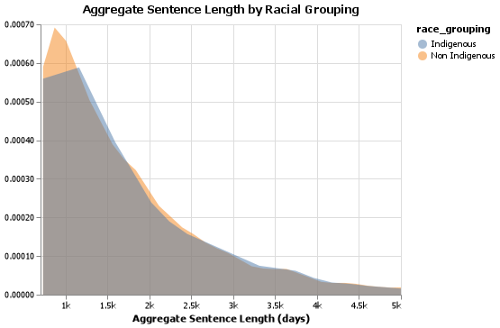
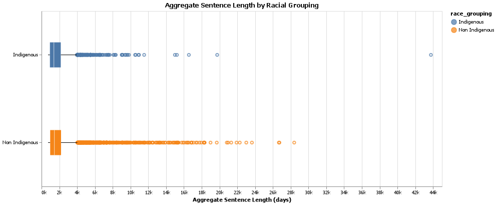
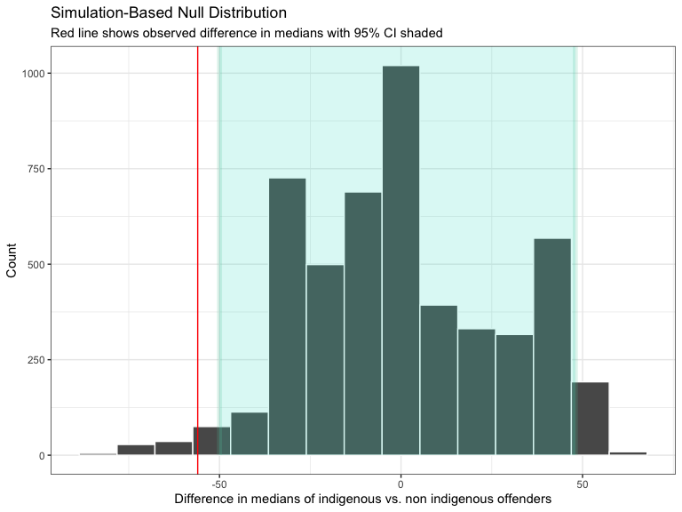

```{r setup, inlude=FALSE, echo=FALSE, warning=FALSE, message=FALSE}
knitr::opts_chunk$set(echo = FALSE)
library(knitr)
library(kableExtra)
library(tidyverse)
```  

```{r hypothesis_test_objs}
p_value <- readRDS(paste(params$results_dir_path, "/p_value.rds", sep=""))
null_distribution_plot <- readRDS(paste(params$results_dir_path, "/null_distribution.rds", sep=""))
ci_95 <- readRDS(paste(params$results_dir_path,"/ci_95.rds", sep=""))
diff_medians <- readRDS(paste(params$results_dir_path, "/diff_medians.rds",  sep=""))
```

# Summary 

For this project we have carried out a hypothesis test to determine if there was a significant difference in the median sentence lengths between the indigenous and non-indigenous offenders under the Correction Services Canada. The median was selected as the measure of central tendency as the distribution of sentence length for both groups were skewed. Subsequently, a permutation test under the null model was carried out computationally with a significance level of 0.05. The null hypothesis stated that there was no difference in the population medians in sentence length between indigenous and non-indigenous offenders. The alternate hypothesis stated that there is a difference in the population medians in sentence length between indigenous and non-indigenous offenders. The resulting sample difference in the two medians was `r diff_medians`, with a corresponding p-value of `r p_value`. The indigenous group was found to have shorter sentence lengths than the non-indigenous group. As this $p$-vaule was smaller than the significance level, there was statistically significant evidence to reject the null hypothesis that stated that there is no statistically significant difference in the median sentence lengths between the two groups. As the test was carried out using a small alpha of 0.05, it can be assumed that the chance of Type I error was small. However, as we had a large sample size for both groups, our model was very sensitive to small differences in the median of both groups. Though this may raise some concern regarding the practical implications of the study, we believed it was important not to miss any existing effect due to the sensitivity of the issue at hand. The cost of a Type II error is more significant than a Type I error.   

# Introduction 

The number of indigenous incarcerations in Canada has increased by 40% in the prison system over the last decade, a faster rate than any other group [@owusu2014years].  Issues such as increased domestic violence, disruptions in societal structure and norms and health issues are aggravated in highly incarcerated groups [@freudenberg2001jails]. Hence, these rates are likely to worsen.  

As this population is so vulnerable, the other key factor that should be investigated is if there is a difference in the length of the sentence between the indigenous and non-indigenous groups. This is an important question to infer because if a significant difference is found, it can lead to further studies on the type of charges either group is subject to, or whether any particular laws disadvantage the indigenous group. Additionally, the study could also lead to an exploration of biases present in the current legal system during sentencing. 

# Methods 

Methodology for this study follow the basic principles of hypothesis testing. Data processing and specifics of the analysis discussed below.

## Data 

The data set used for this study is the Offender Profile from 2017-2018 released by the Correctional Service of Canada. The link to this site can be found [here](https://open.canada.ca/data/en/dataset/844ff1e3-e137-41be-9ebe-6bd9843c1a53). Each entry in the data set corresponds to a single offender serving a two or more year long sentence. The demographic details such as age, gender and marital status at year end are provided for each entry. This was retrieved from the Offender Management System (OMS).

##  Analysis

A hypothesis test with a significance level of 0.05 was carried out to determine if there was a statistically significant difference in the medians of the sentence length between the indigenous and non-indigenous groups. The features used from the data set to complete this analysis were the racial grouping, which was already separated into indigenous and non-indigenous, and aggregate sentence length. The median was selected as the measure of central tendency and the permutation test under the null hypothesis. Hence the hypothesis test was defined as the following: 

$H_0$: The median length of sentences of indigenous group, $M_1$, is equal to the median length of sentences of non-indigenous group, $M_2$.

 $H_A$: The median length of sentences of indigenous group, $M_1$, is equal to the median length of sentences of non-indigenous group, $M_2$.

 Test statistic: $\hat{M}_1-\hat{M}_2$.

The R [@R] and Python programming languages [@Python] and the following R and Python packages were used to perform the analysis:  docopt [@docopt],  knitr [@knitr], tidyverse [@tidyverse], infer [@infer], docopt [@docoptpython] and altair [@altair]. The code used to perform the analysis and create this report can be found [here](https://github.com/UBC-MDS/DSCI_522_inference_on_indigenous_vs_non_indigenous_sentence_length_differences).

# Results and discussion 

The only relevant columns for our hypothesis test were the ‘aggregate sentence length’ and the ‘racial grouping’. ‘Racial grouping’ column was included in the report and summarized data from the ‘race’ columns into two categories. “Aboriginal” corresponded to the offenders with a race of “First Nations”, “Métis”, or “Inuit”. “Non Aboriginal” corresponded to all others. Note that this information was self-reported.

```{r counts, inlude=FALSE, echo=FALSE, warning=FALSE, message=FALSE}
counts <- read_csv('../results/group_counts.csv')
```

All other columns were dropped. The count of observations in either group was `r counts$Count[2]` and `r format(counts$Count[1])`, meaning we had a large enough sample size to carry out a t-test.

```{r observations_group}
knitr::kable(counts, caption = "Table 1. Number of observations in each group.", col.names = c("Group",
                           "Count of Offenders"))

                
```
<br />
To decide what kind of measure of central tendency to apply in our hypothesis test, we looked at the distribution of the sentence lengths of either group (orange - non-indigenous, blue - indigenous) using a density plot. The distributions for both groups were right skewed, so we decided to use the median as our parameter as it is less affected by the outliers. 

```{r desnity, fig.width=7, fig.height=3, fig.cap = "Figure 1. The distribution of the aggregate sentence length of offenders by racial group.", out.width='100%'}

```

Looking at the boxplot, we noted the large overlap in the confidence intervals between the two groups, which at a glance indicated that a statistically significant difference was unlikely. 

```{r boxplots, fig.width=10, fig.height=3, fig.cap = "Figure 2. The boxplot of the sentence length of offenders by racial group. The marker at the center of the box corresponds to the median.", out.width='100%'}


```

We had a large enough sample size to apply a permutation test as the toal sample size was `r format(counts$Count[1] + counts$Count[2])`. We carried out the permutation test with r N_REPEATS under the null hypothesis, computing and comparing the median for each of the two groups.

The null hypothesis stated that there is no difference in the median sentence lengths between the indigenous and non-indigenous offenders. The alternate hypothesis stated that there is a difference in the median sentence lengths between the indigenous and non-indigenous populations. The test statistic was the difference in the sample medians of the two groups. The significance level was set to 0.05. 

The distribution under the null hypothesis has the expected normal shape due to the sample size and number of repetitions.

```{r Null Distribution 3, fig.width=10, fig.height=3, fig.cap = "Figure 3. The distribution of the medians generated using a permutation test under the null distribution.", out.width='100%'}

#
null_distribution_plot
```


The difference in the sample test medians was `r diff_medians`, which corresponded to a p-value of `r p_value` from the two-tailed test. The test statistic falls beyond in the left tail in the distribution. As the $p$-value is smaller than the significance level of 0.05, we can state that there is statistically significant evidence to reject $H_0$. Hence there is a significant difference in the sentence length of sentences between indigenous and non-indigenous offenders in the Correctional Services of Canada.

Though our study discovered a statistical significance in the difference in the estimates, the practical takeaway must take into consideration the effect size, the sample size, and possible sources of error. The sample size of both groups in the study was very large, and therefore our model was very sensitive to small effects. This meant there was a high risk of committing Type II error, in which we incorrectly reject the null hypothesis. However, for this particular study, minimizing Type I error is more significant than Type II error. Missing out on a difference in sentence lengths between the two groups is costly as it will curb efforts to conduct further studies on the issue. This will be detrimental to the already vulnerable indigenous population. 


A follow-up study to this could combine the offenders data from multiple years to increase the sample size, and potentially conduct the hypothesis test with a larger alpha value. Additionally, a study that controls for other variables, most notably the nature of the offence, could give us better and more nuanced understanding of the the possible correlations and dynamics. 


# References